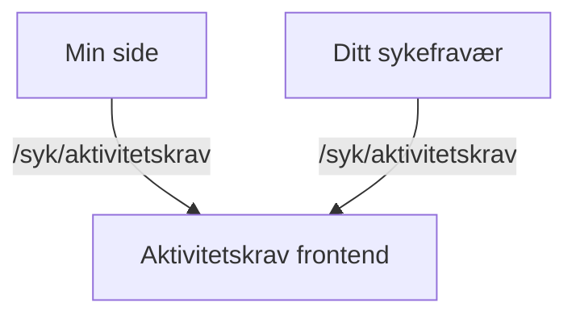

# Aktivitetskrav frontend app

**Important:** To get started with building and running the app, read our [wiki for Next.js apps](https://github.com/navikt/esyfo-dev-tools/wiki/nextjs-build-run).

## Purpose of the app

This app is used to show the status of the activity requirement for logged-in users on `Min Side`.

### Activity requirement view

The user gets an overview of their activity duty (aktivitetsplikt). This includes:

- Advance warnings about possible stoppage of sick pay (Varsel om mulig stans av sykepenger).
- Information about deadlines and how to avoid stoppage.
- Legal basis for the requirement.
- A timeline of previous events and assessments.

**Base path** `/syk/aktivitetskrav`

### Assessment details

This view provides detailed information about a specific assessment or event, such as:

- Information letters about the activity duty (Info om aktivitetsplikt).
- Explanations of how NAV assesses the duty.
- Implications for the user (potential stoppage of sick pay).
- Instructions on what the user needs to do.

**Path** `/syk/aktivitetskrav/[uuid]`

## Backend API

The frontend app communicates with the backend via `esyfo-proxy`.

Used endpoints:

- **GET** `/historikk` - Fetches history of activity requirement assessments
- **POST** `/les` - Marks advance warning as read
