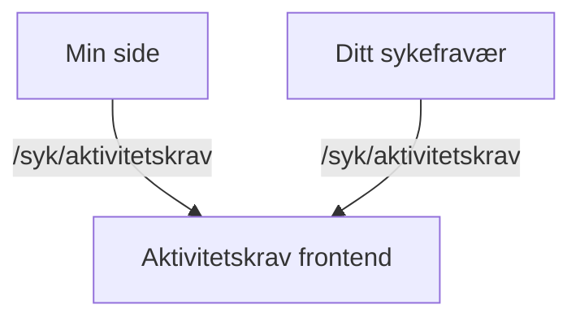

# Aktivitetskrav frontend app

**Viktig:** For å komme i gang med å bygge og kjøre appen, les vår [wiki for Next.js apps](https://github.com/navikt/esyfo-dev-tools/wiki/nextjs-build-run).

## Formål med appen

Denne appen brukes til å vise status for aktivitetskravet for innloggede brukere på `Min side`.

### Visning av aktivitetskrav

Brukeren får en oversikt over sin aktivitetsplikt. Dette inkluderer:

- Varsel om mulig stans av sykepenger.
- Informasjon om frister og hvordan unngå stans.
- Lovgrunnlag for kravet.
- En tidslinje over tidligere hendelser og vurderinger.

**Base path** `/syk/aktivitetskrav`

### Vurderingsdetaljer

Denne visningen gir detaljert informasjon om en spesifikk vurdering eller hendelse, som:

- Info om aktivitetsplikt.
- Forklaringer på hvordan Nav vurderer kravet.
- Konsekvenser for brukeren (mulig stans av sykepenger).
- Instruksjoner om hva brukeren må gjøre.

**Path** `/syk/aktivitetskrav/[uuid]`

## Backend API

Frontend-appen kommuniserer med backend via [eSYFO proxy](https://github.com/navikt/esyfo-proxy).

Endpoints som brukes:

- **GET** `/historikk` - Henter historikk over vurderinger av aktivitetskrav
- **POST** `/les` - Markerer varsel som lest
