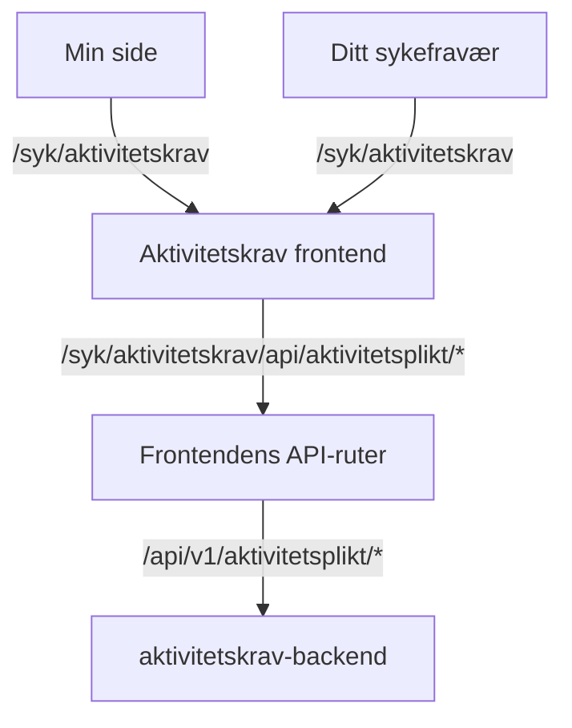

# Aktivitetskrav frontend app

## Miljøer

[🚀 Produksjon](https://www.nav.no/syk/aktivitetskrav)

[🛠️ Utvikling](https://www.ekstern.dev.nav.no/syk/aktivitetskrav)

[🎬 Demo](https://demo.ekstern.dev.nav.no/syk/aktivitetskrav)

## Formål med appen

Denne appen brukes til å vise status for aktivitetskravet for innloggede brukere på `Min side`.

```mermaid
graph TD
    MinSide[Min side] -->|"/syk/aktivitetskrav"| App[Aktivitetskrav frontend]
    DittSykefravaer[Ditt sykefravær] -->|"/syk/aktivitetskrav"| App
    App -->|"/syk/aktivitetskrav/api/aktivitetsplikt/*"| ApiRoutes[Frontendens API-ruter]
    ApiRoutes -->|"/api/v1/aktivitetsplikt/*"| Backend[aktivitetskrav-backend]
```

### Visning av aktivitetskrav

Brukeren får en oversikt over sin aktivitetsplikt. Dette inkluderer:

- Varsel om mulig stans av sykepenger.
- Informasjon om frister og hvordan unngå stans.
- Referanser til lovgrunnlag.
- En tidslinje over tidligere hendelser og vurderinger.

**basePath**[^basepath] `/syk/aktivitetskrav`

### Vurderingsdetaljer

Denne visningen gir detaljert informasjon om en spesifikk vurdering eller hendelse, som:

- Info om aktivitetsplikt.
- Forklaringer på hvordan Nav vurderer kravet.
- Konsekvenser for brukeren (mulig stans av sykepenger).
- Instruksjoner om hva brukeren må gjøre.

**basePath**[^basepath] `/syk/aktivitetskrav/[uuid]`

## Backend-API

Frontend-appen kommuniserer med `aktivitetskrav-backend` via egne API-ruter i Next.js.

Endpoints som brukes:

- **Frontend:** `GET /syk/aktivitetskrav/api/aktivitetsplikt/historikk` → **Backend:** `GET /api/v1/aktivitetsplikt/historikk` - Henter historikk over vurderinger av aktivitetskrav
- **Frontend:** `POST /syk/aktivitetskrav/api/aktivitetsplikt/les` → **Backend:** `POST /api/v1/aktivitetsplikt/les` - Markerer varsel som lest

## Utvikling (kjøre lokalt)

For å komme i gang med bygging og kjøring av appen, les vår [wiki for Next.js-applikasjoner](https://github.com/navikt/esyfo-dev-tools/wiki/nextjs-build-run).

Når appen er startet, åpne http://localhost:3000/syk/aktivitetskrav

[^basepath]: `basePath`-verdien settes i Next.js-konfigurasjonen i `next.config.ts` og angir URL-prefikset som hele appen lever under.
